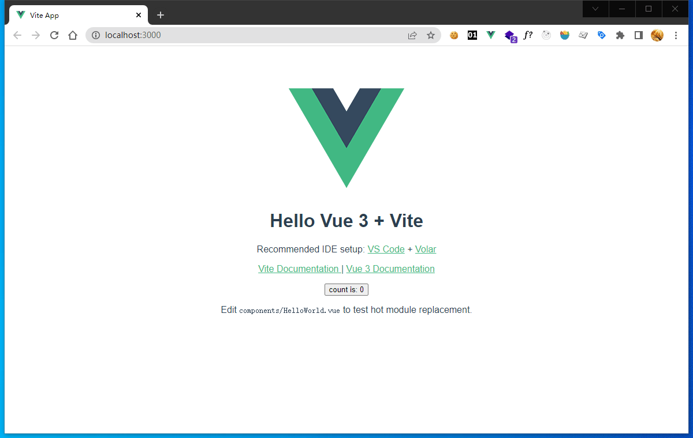

## Create Vue 3 project with Vite
There is several ways to create Vue project.Because we use vite as build tool, so we create Vue project with Vite for simple.

First of all, you should install `node` and `npm` tools, and config them rightly. Then you can continue the tutorial.

Let's execute `npm init vite` in the directory you think is good.
```powershell
PS D:\blog\vue3>npm init vite
Need to install the following packages:
  create-vite
Ok to proceed? (y)
```
If you are promopted by `create-vite`, press `enter` key to install it.

```powershell
√ Project name: ... vue3-admin
? Select a framework: » - Use arrow-keys. Return to submit.
    vanilla
>   vue
    react
    preact
    lit
    svelte
```
Then input the project name `vue3-admin`, and select `vue` as the framework.

```powershell
? Select a variant: » - Use arrow-keys. Return to submit.
>   vue
    vue-ts
```
Select `vue` as the variant, we don't use Typescript with this project.You can select `vue-ts` if you want to use Typescript.

```powershell
Scaffolding project in D:\blog\vue3\vue3-admin...

Done. Now run:

  cd vue3-admin
  npm install
  npm run dev
```
Run above commands. 
```powershell
 vite v2.9.13 dev server running at:

  > Local: http://localhost:3000/
  > Network: use `--host` to expose

  ready in 476ms.
```
By default, the project is served on port 3000,if it is not occupied by other application.Then you can open `http://localhost:3000/` in your browser.Finally we get the welcome page as below.


## Config Tailwind CSS UI framework
About Tailwind CSS

*A utility-first CSS framework packed with classes like flex, pt-4, text-center and rotate-90 that can be composed to build any design, directly in your markup.*

I use Tailwind CSS for several reasons:

1. class utilities are easy to remember.
2. good compatability for different browsers.
3. easy config for variant themes and colors.

Now starting the configuration. There is an official document for vite: `https://tailwindcss.com/docs/guides/vite`

Let's start our configuration based on previous steps of the actual project, which may have some nuance.

### Install Tailwind CSS
```powershell
npm install -D tailwindcss postcss autoprefixer
npx tailwindcss init
```
After these commands, Tailwind CSS config file `tailwind.config.js` and postcss config file `postcss.config.js` will be created.
### Configure your template paths
**`tailwind.config.js`**
```js
/** @type {import('tailwindcss').Config} */
module.exports = {
  content: [
    "./index.html",
    "./src/**/*.{vue,js,ts,jsx,tsx}",
  ],
  ...
};
```
Template paths contain files that tailwind would parse.
### Add the Tailwind directives to your CSS
Create `index.css` in `src` directory.

**`src/index.css`**
```css
@tailwind base;
@tailwind components;
@tailwind utilities;
```

Import `index.css` into `main.js`.

**`src/main.js`**
```js
...
import "./index.css";
...
```
### Verify your configuration
Edit `App.vue`, add a `h1` tag, show some messages.

**`src/App.vue`**
```html
<template>
  <h1 class="underline text-red-500 text-3xl">Hello Tailwind CSS</h1>
  ...
</template>
```
Run `npm run dev`

